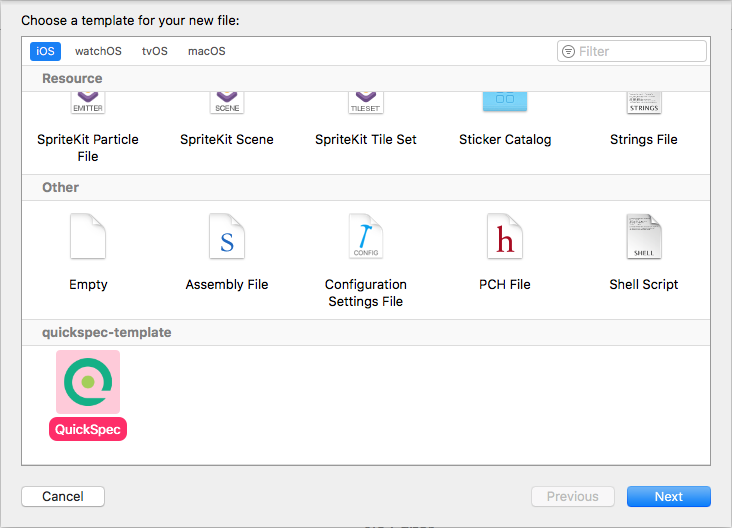

# Overview

This is a simple QuickSpec template used when creating a new file in Xcode.



# Installation

Simply run

```zsh
$ sh install.sh
```

Or copy the `quickspec` folder to `~/Library/Developer/Xcode/Templates/quickspec-template`